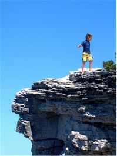
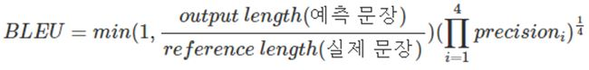
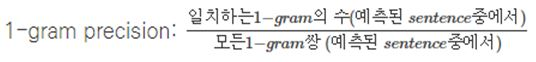
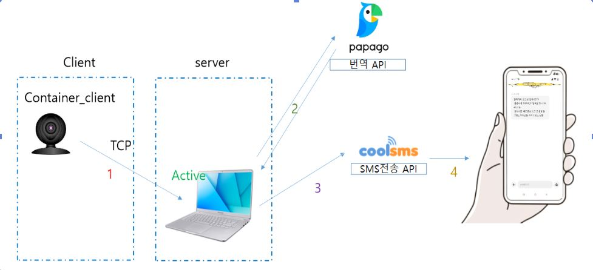
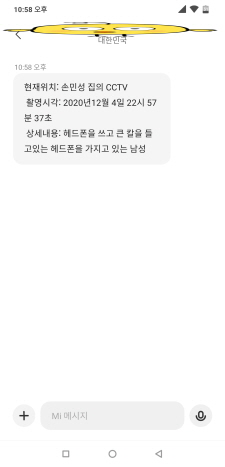

# Image_Captioning 2020년 2학기 한림대학교 빅데이터 CapstoneDesign
- 20155129 빅데이터 공학과 손민성
- 20143505 디스플레이 학과 김준영 

## 지도교수님
- 임성훈

## 참여기업
- 지오비전

## 사용언어
- Python 3.6

## 사용기술
- tensorflow
- python
- docker
- CNN
- RNN
- NLP
- cuda -GPU

## 개발환경 
- Jupyter Notebook
- Docker _tensorflow _gpu server
- pycham

## 개발 목적
### 스마트 CCTV를 이용하여 특이사항을 검출하는 프로그램은 open source로 많이 존재한다. 하지만 이러한 프로그램들의 경우 대체적으로 공통적인 문제점이 발생하는것을 확인할수있다.
### 첫번째는 낮은 인식률이다. 기본적으로 다양한 환경에서 작동하는 CCTV의 특징상 시간의 변화와 그림자와 연관된 명암의 변화의 경우 제대로된 인식에서 조차 문제가 생기며
### 모션을 인식하여 폭력상황을 검출하는경우 실제적으로 인간의 몸에 선을 그려 모션을 인식하는데 손에 들고있는것이 가방이든 칼이든 선으로 나타나는 문제가 생겨 흉기를 사용한 폭력상황인지 아니면 가방이 흔들리며 뛰어가는 상황인지등을 구별해내지 못하는 문제등이 발생한다. 
### 하지만 영상을 문장으로 바꾸면 어떨까? 비록 사람이 실제적으로 말하는 문장에 비하면 어색할지라도 단순히 이 상황이 어떤 상황인지를 알기위한 단어들만이 나타나질수있다면 충분한 구분의 대상이 될거라고 생각된다. 
### 또한 이미지를 직접 전송하는것에 비해 문장을 전송한다면 전송에 사용되는 통신량과 저장에 필요한 스토리지공간이 획기적으로 줄어들수있고 실제 이미지를 확인시 주변의 다른사람의 프라이버시를 보호할수있도록 문제영역만을 검출해낼수있다면 보안적으로도 충분한 효과를 누릴수 있을것이다.

  

## 개발 추진 내용
 

### 1. docker를 이용한 GPU_tensorflow 서버 생성 
 

#### 해당 사항은 window 기반 docker를 기반으로 tensorflow/tensorflow:latest-gpu-jupyter 이미지를 사용하여 구동하였다.
#### host의 port를 연결한 포트포워딩 방식으로 외부에서 접속을 가능하게 설계하였고
#### docker swarm을 이용한 클러스터를 이용하여 1개의 manager와 2개의 worker노드를 설정하였다.
#### fail over 방식은 Active Standby를 이용하여 구현하였다.
#### 실제적으로 프로그램이 실행되자마자 바로 TCP소켓이 실행되도록 TCP_SERVER.py를 daemon으로 하여 systemctl을 통한 enable service로 구현하였다. 
 

### 2. client에서 구동가능한 object detection 프로그램 (CCTV)
 

#### Tensorflow yoloV4를 기반으로한 object detection 프로그램을 기반으로 간단한 수정을 통해 원하는 이미지를 추출할수 있게끔 수정하였으며
#### TCP 소켓 통신을 통한 데이터 전송을 할수 있도록 코드를 작성하였다.
 

### 3. Server에서 구동가능한 image captioning 프로그램 
 

#### 최초 한국어와 영어 두가지 데이터를 사용하여 프로그래밍을 시도하였다.
#### 한국어의 경우 영어에 비해 단어의 조합이많아 vocab사이즈가 커졌으며 전처리에도 시간이 많이걸려 낮은 gpu성능상 out of memory가 발생되어 영어로 채택하였다.
#### 또한 높은 성능을 이끌어 내기위해서는 많은 데이터가 필요하나 1개의 이미지당 5개의 문장을 매핑시켰기에 이미지가 1만장이라면 문장이 5만여개가 되어버린다.
#### 이러한 문장 데이터셋이 존재하지 않아 직접 데이터셋을 마련해야하는데 이를 직접 마련하기엔 시간적문제가 커 실제적으로 googletrans를 사용하여 번역을 하였지만
#### 2020년 11월 26일 기준으로 일정횟수 이상 api사용시 google에서 ip를 차단시켜버려 데이터 마련에도 어려움을 겪었다.
#### 이에따라 기존에 많은 데이터가 존재한 ms coco 2017데이터셋을 사용하였으며 11만8천여개의 이미지와 60만여개의 캡셔닝된 문장을 데이터로 사용하여 학습을 진행하였다. 
 

### 이미지 캡셔닝

CCTV 관련된 프로젝트를 진행하는데 늘 따라오는 고질적인 문제는 언제나 보안 및 사생활 침해였다. 이러한 고질적인 문제는 이미지, 영상 등을 전송하면 받는 입장에서 누군가 이 영상을 봐야하기 때문에 항상 해결하기 어려운 과제였다. 하지만 컴퓨터가 분석을 해서 내놓은 문장만을 전송한다면 어떨까? 영상에서 핵심이 되는 단어를 추출하여 문장으로 완성시켜 전송할 경우 사람이 위험하거나 재난 상황이 발생한 영상에서 핵심만을 파악하고 영상보다 적은 용량을 차지하는 문장으로 빠르게 전달할 수 있으며, 중간에서 누군가 정보를 탈취하였다 하더라도 정상적인 수신자에게 불필요한 정보인 개인의 사생활정보는 해킹범이 얻을 수 없다. 따라서 개인의 사생활이 전보다 더 보호받는 삶을 영위할 수 있다.

이미지에서 문장을 추출하기 위해 우리가 선택한 방법은 Image Captioning 이었다.

Image Captioning이라는 기술을 구현하기 위해 CNN(Convolutional Neural Network)과 RNN (Recurrent Neural Network)을 사용하였다. 이들을 사용하는 모듈로 tesorflow를 사용하였고, 좀 더 직관적으로 결과를 확인하기 위해서 개발 환경으로는 Jupyter Notebook을 사용하였다.

기존 Git이나 학습용 책에서 보여주는 모든 Open Source에서는 영어를 사용한 문장 생성을 하는 모습을 볼 수 있었다. 우리는 한국어 캡셔닝을 위하여 문장의 형태소 분석에 들어갔고, Konlpy의 Okt를 사용하여 모든 형태소에 대한 토큰화를 실행하여 단어장을 만든 뒤 문장 생성을 시작하였다.

하지만 이미지 캡셔닝 모델의 학습 과정에서 문제가 발생하였다.
1. 학습시간의 장기화 
2. 데이터의 부족
3. 성능지표로서의 loss의 무관함

.
--- 

1. 학습시간의 장기화에서는 기존 CPU를 통한 연상 방식에서 GPU를 사용한 연산으로 바꿈으로써 적게나마 속도를 향상시켰으며 RNN 모델에서는 LSTM에서 GRU를 사용하여 복잡도를 낮추어 속도를 향상시켰다.

2. 현재 이미지 학습에 사용하는 이미지 데이터는 1만여 개 텍스트 문장은 5만여 개이다. 이러한 데이터를 만들어내기 위해서는 기존 영어로 되어있는 문장 데이터들의 경우 번역기를 돌려야 하고, 아니라면 직접 손수 번역하여 데이터를 만들어야 하는데 이러한 데이터를 만들기에는 너무나 많은 시간이 소모가 된다. 또한 데이 현재의 데이터로도 100번의 학습 시 소요되는 시간은 1000분이다. 17시간이 소모된다. 유의미한 학습을 진행하기 위해선 수천 번의 학습이 필요한데 이보다 많은 데이터를 학습 시 소요되는 시간이 증가하였기에 대학교 내 GPU 사용 신청서를 제출하였다.

3. 해당 이미지를 테스트 하였을 때 가장 적합하게 출력된 문장은

이다 하지만 이러한 문장의 loss 값은 여러 가지가 나오는데. 적게는 1.38에서 많게는 2.1까지 같은 문장이라도 나오는 loss 값이 다르게 나온다는 것이다. 딥러닝을 배울 때 loss를 평가 지표로 사용하는 것에 익숙해져 있었기에 새로운 평가 지표를 찾는데 많은 어려움을 겪었고 결국 여러 인공지능 번역기에 사용하는 Bleu를 평가 지표로 사용하게 되었다.

)

예측 문장과 실제 문장에 들어가는 것은 해당 문장의 형태소 단위로 토큰화를 시도한 1차원 벡터 형태의 값이 들어간다.
즉 “아이는 절벽의 가장자리 근처에 서 있습니다.”라는 문장을
“['아이', '는', '절벽', '의', '가장자리', '근처', '에', '서', '있습니다', '.']”로 변환한다는 것이다.
또한 BLEU를 사용할 때 각 단어의 조합으로 1-gram , 2-gram과 같은 단위로 사용하는데 이는 N 개의 단어에 대한 순서쌍들이 얼마나 겹치는지를 측정한다. 이러한 과정을 넣고 연산을 한다면

이 되는 것이다. 이러한 연산을 1-gram~ 4-gram까지 총 4번을 수행하여 이들에 대한 곱셈 연산을 수행하는 데 결론적으로 만들어지는 문장의 길이가 짧아 4-gram 이상의 순서쌍 조합은 0이 나오므로 모든 문장에 대한 확률 값이 결국 0이 돼버리는 문제가 발생하였다. 이를 해결하기 위해 가중치를 주어 4-gram은 연산에서 제외하였다. 즉,

이 되는 것이다. 평가지표와 optimizer에 관한 자세한사항은 [Server](https://github.com/iconms12/Image_Captioning/tree/master/server)
폴더를 참고 하길 바란다.

## 프로젝트 개발 결과물 소개 (+ 다이어그램)

### 위의 다이어 그램을 보면 알수 있듯이 호스트 PC의 웹캠을 통해 영상을 서버로 송출한뒤
### 서버에서 받은 영상을 실시간으로 사전에 학습해둔 딥러닝 모델을 이용하여 나온 결과를 반환한다
### 이과정에서 Swarm 클러스터로 두개의 컨테이너는 연결되어 있으며 Active 서버가 다운되는순간 Stanby서버가 Active상태로 바뀌며 전송받은 영상을 처리한다. 영상은 딥러닝 모델을 통과하였을시 문장으로 바뀌며 해당 문장의 단어 비교를 서버에서 행한뒤 
### 해당 문장안에 위험한 단어가 들어가 있을시 그문장을 번역기를 이용해 한국어로 변환후 반환받는다.
### 반환받은 문장은 SMS API를 통해 나의 핸드폰으로 전송된다.
   

## 개발 결과물을 사용하는 방법 소개 (+ 프로그램 구동 화면 스크린 샷 첨부)
 

### server와 client를 나눠 각각 폴더안의 데이터를 넣어 사용하여도 무관하며
### 하나의 컴퓨터에 server와 detection을 같이넣어 구동하여도 문제없다.
### 결과물의 자세한 사용방법은 github의 각 [Server](https://github.com/iconms12/Image_Captioning/tree/master/server)와 [object_detect](https://github.com/iconms12/Image_Captioning/tree/master/object_detect) 폴더의 README.md를 참조
### 하면 나와있으며, 당연하지만 webcam이 필요하다. 
 

# 최종 결과물
## 전송된 이미지

## 핸드폰으로 전송된 문장

 

  

## 개발 결과물의 필요성, 활용방안 및 기대효과
###  2017년 8월 기준으로 대한민국의 CCTV설치 및 운영대수는 810만여대이다.
### 이러한 운영대수는 해가 지나감에따라 꾸준히 상승중이며 국가 인권위원회가 개인의 라이프 사이클에 따른 CCTV 노출 횟수를 분석한결과 성인기준으로 하루 81회의 노출이 발생한다고한다.
### 이러한 CCTV는 한사람이 지속적으로 관찰하는것 자체가 보는사람 입장에서도 스트레스를 받으며 실제적으로 군대를 다녀온 성인남성이라면 알듯이 제대로된 감시가 불가능하다.
### 결국 사건이 터지고서야 사후 약방문과 같은 형식으로 과거 영상을 돌려보는식의 증거확인용으로만 사용되는것이 현재 CCTV의 활용도라 할 수 있다.

### 하지만 감시자가 지속적인 감시대신 직접 순찰을 하던 도중 문제가되는 영상을 CCTV가 자동으로 감지하여 핸드폰으로 알려준다면 어떨까? 경찰의 순찰의 효과를 보았을시 범죄예방과 가시적 순찰을 통한 체감안전도향상과 범죄 심리 차단효과등이 순찰에서 나타난다. 
### 이러한 순찰과 맞물려 CCTV의 알림효과로 순찰도중 바로 해당 위치로 이동을 할수있기에 실제적으로 높은 범죄예방률이 기대되며 최소한 빠른 사후처리가 가능할것이다.
### 우리가 학습했던 방법은 일반적인 사진들을 포함하여 학습시킨 결과로 특수한 상황에 최적화된 학습이 아니었음에도 위험물에 대한 객체 검출이 가능했다. 이를 특수한 상황에 맞춰 학습시킨다면 위험물 검출의 효율은 큰 폭으로 상승할 것으로 예상된다.
### 검출의 효율이 상승하게 되어 정확도가 높아진다면 사람을 통해 실시간 모니터링을 하지 않고 학습을 통해 만들어지는 객관적인 문장이 정확한 상황 전달과 빠른대처를 가능하게 해주면서 효율적인 인력 동원을 통해 운영 비용의 감소 효과도 기대된다.
