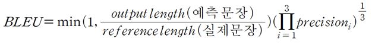

# Image_Captioning 2020년 1학기 한림대학교 빅데이터 CapstoneDesign
- 20155129 빅데이터 공학과 손민성
- 20143505 디스플레이 학과 김준영 

## 지도교수님
- 임성훈

## 참여기업
- 지오비전

## 사용언어
- Python 3.6

## 사용기술
- pytorch
- CNN
- RNN
- NLP
- cuda -GPU

## 개발환경 
- Jupyter Notebook

## 개발 목적

## 개발 추진 내용

### 이미지 캡셔닝 부분

CCTV 관련된 프로젝트를 진행하는데 늘 따라오는 고질적인 문제는 언제나 보안 및 사생활 침해였다. 이러한 고질적인 문제는 이미지, 영상 등을 전송한다면 누군가는 이러한 영상을 보아야 하기에 해결하기 힘든 문제라고 할 수 있다. 하지만 컴퓨터가 분석을 해서 내놓은 문장만을 전송한다면 어떨까? 최소한 이미지를 전송하는 것보다는 나의 사생활이 조금은 보호받는다고 할 수 있을 것이다. 

이미지에서 문장을 추출하기 위해 우리가 선택한 방법은 Image Captioning 이었다.

Image Captioning이라는 기술을 구현하기 위해 CNN(Convolutional Neural Network)과 RNN (Recurrent Neural Network)을 사용하였다. 이들을 사용하는 모듈로 pytorch를 사용하였고, 좀 더 직관적으로 결과를 확인하기 위해서 개발 환경으로는 Jupyter Notebook을 사용하였다.

기존 Git이나 학습용 책에서 보여주는 모든 Open Source에서는 영어를 사용한 문장 생성을 하는 모습을 볼 수 있었다. 우리는 한국어 캡셔닝을 위하여 문장의 형태소 분석에 들어갔고, Konlpy의 Okt를 사용하여 모든 형태소에 대한 토큰화를 실행하여 단어장을 만든 뒤 문장 생성을 시작하였다.

하지만 이미지 캡셔닝 모델의 학습 과정에서 문제가 발생하였다.
1. 학습시간의 장기화 
2. 데이터의 부족
3. 성능지표로서의 loss의 무관함

.
--- 

1. 학습시간의 장기화에서는 기존 CPU를 통한 연상 방식에서 GPU를 사용한 연산으로 바꿈으로써 적게나마 속도를 향상시켰으며 RNN 모델에서는 LSTM에서 GRU를 사용하여 복잡도를 낮추어 속도를 향상시켰다.

2. 현재 이미지 학습에 사용하는 이미지 데이터는 1만여 개 텍스트 문장은 5만여 개이다. 이러한 데이터를 만들어내기 위해서는 기존 영어로 되어있는 문장 데이터들의 경우 번역기를 돌려야 하고, 아니라면 직접 손수 번역하여 데이터를 만들어야 하는데 이러한 데이터를 만들기에는 너무나 많은 시간이 소모가 된다. 또한 데이 현재의 데이터로도 100번의 학습 시 소요되는 시간은 1000분이다. 17시간이 소모된다. 유의미한 학습을 진행하기 위해선 수천 번의 학습이 필요한데 이보다 많은 데이터를 학습 시 소요되는 시간이 증가하였기에 대학교 내 GPU 사용 신청서를 제출하였다.

3. 해당 이미지를 테스트 하였을 때 가장 적합하게 출력된 문장은

이다 하지만 이러한 문장의 loss 값은 여러 가지가 나오는데. 적게는 1.38에서 많게는 2.1까지 같은 문장이라도 나오는 loss 값이 다르게 나온다는 것이다. 딥러닝을 배울 때 loss를 평가 지표로 사용하는 것에 익숙해져 있었기에 새로운 평가 지표를 찾는데 많은 어려움을 겪었고 결국 여러 인공지능 번역기에 사용하는 Bleu를 평가 지표로 사용하게 되었다.

)

예측 문장과 실제 문장에 들어가는 것은 해당 문장의 형태소 단위로 토큰화를 시도한 1차원 벡터 형태의 값이 들어간다.
즉 “아이는 절벽의 가장자리 근처에 서 있습니다.”라는 문장을
“['아이', '는', '절벽', '의', '가장자리', '근처', '에', '서', '있습니다', '.']”로 변환한다는 것이다.
또한 BLEU를 사용할 때 각 단어의 조합으로 1-gram , 2-gram과 같은 단위로 사용하는데 이는 N 개의 단어에 대한 순서쌍들이 얼마나 겹치는지를 측정한다. 이러한 과정을 넣고 연산을 한다면

이 되는 것이다. 이러한 연산을 1-gram~ 4-gram까지 총 4번을 수행하여 이들에 대한 곱셈 연산을 수행하는 데 결론적으로 만들어지는 문장의 길이가 짧아 4-gram 이상의 순서쌍 조합은 0이 나오므로 모든 문장에 대한 확률 값이 결국 0이 돼버리는 문제가 발생하였다. 이를 해결하기 위해 가중치를 주어 4-gram은 연산에서 제외하였다. 즉,

이 되는 것이다. 이러한 연산을 행했을 때 55%의 정확도를 보여주어 이를 평가지표로 선택하게 되었다.